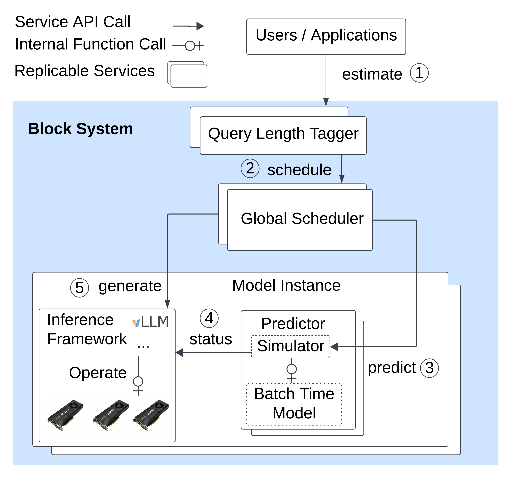

# Block

**Block: Balance Loader of LLM Serving with Context ,Knowledge and Predictive Scheduling** ([paper link](https://arxiv.org/abs/2508.03611))

Block is a research prototype that explores *predictive, performance-aware scheduling* for distributed large-language-model (LLM) inference.
It builds on top of Microsoft’s [Vidur](https://github.com/microsoft/vidur) simulator, which initially developed for offline evaluation and optimal configuration searching and adds

* a side-car *Predictor* service that forecasts per–instance leading metrics with Vidur at run time,
* a *Global Scheduler* that uses these predictions (or live metrics) to route requests, and
* tooling for training a light-weight length-estimator model so the scheduler can reason about prompts it has never seen before.

Everything needed to reproduce the paper’s results—source code, datasets, experiment scripts—lives in this repository and is anonymised for the reviewing process.

---

## 1. Architecture at a Glance



• **Predictor** (`block/predictor`)
 Co-locates with every inference node. Collects live stats, or spins up a Vidur simulation on-demand, and answers *“What if I got one more request?”*

• **Global Scheduler** (`block/global_scheduler`)
 Receives requests, queries Predictors, and applies the scheduling policy (default: Block; alternatives: LLumnix, round-robin, …).

• **Query Length Tagger** (`block/length_estimation`)
 A RoBERTa-based regressor that predicts the response-token count for unseen (model, prompt) pairs, feeding the scheduler with input-aware cost estimates. Currently, we just run this model offline to tag the ShareGPT dataset with predicted response length in `data/trace_data/sharegpt/generate` but it should be easy to adapt to any runtime model service as tf-serving or TorchServe.

Block is inference-engine agnostic. We provide an implementation for vLLM 0.7.2 (see the sealed repo at https://github.com/AKafakA/vllm/tree/block).

---

## 2. Repository Layout

```
block/
 ├── predictor/             # side-car prediction service
 ├── global_scheduler/      # request router
 ├── length_estimation/     # training & inference of token-length regressor
 ├── benchmark/             # Poisson load-generator (forked from vLLM)
 ├── config/
 │     └── host_configs.json# cluster description template
 ├── exp/
 │     ├── generate_config.py
 │     ├── setup.sh         # installs deps & deploys cluster
 │     ├── end_to_end_exp_scripts/
 │     └── …                # run, plot, gather
 └── data/                  # ShareGPT, BurstGPT, ArXiv-Summ datasets

vidur # Same as original vidur repo but with new replica scheduler/revised simulator
 ├──  ...
 ├── scheduler
 	 ├── sarathi_replica_scheduler.py # vLLM scheduler simulator with chunked prefill
	 ├── simulate_predict_replica_scheduler.py # class to adapt other simulators/latency linear model into Predictor Service
	 └── …                # other simulators
```

---

## 3. Quick Start

1. Set up cluster
2. Generate the cluster hosts configuration
   
   If using cloudlab, just download its manifest.xml and moved to block/prediction
   
   ```
   python block/exp/generate_config.py --username USERNAME_SSH_TO_HOST
   ```
   
   Otherwise, need to manually generate configration and hostname listing files as examples under block/config.
3. Deploy software stack and vLLM build
   
   ```bash
   sh block/exp/setup.sh
   ```
   
   Insert the vLLM github link if missing or manually distributed vLLM repo to testing workers
4. Start a full end-to-end experiment (≈50 h on 12 × A30 GPUs)

   Fill your Hugging Face token in `exp/run_exp_vllm.sh` and the hostname to run the global scheduler and benchmarking at `exp/experiment.sh`.
   
   And run all end-to-end scripts like
   
   ```bash
   sh block/exp/end_to_end_exp_scripts/main_experiments.sh
   ...
   # results under experiment_output/data/
   ```
 All testing scripts are located in the `block/exp/end_to_end_exp_scripts` directory. These scripts can be used to reproduce different experiments as follows:
 
 - **`main_experiment.sh`**: Generates results for **Figure 6** (refer to **Section 5.3**).
 - **`auto_provision_exp.sh`**: Produces results for **Figure 8** (refer to **Section 5.5**).
 - **`config_search_experiment.sh`**: Used for testing with different batch size and chunk size, corresponding to **Table 2** (refer to **Section 5.6**).
 - **`extension_experiment.sh`**: Tests with the Qwen model and the BurstGPT dataset, also related to first 2 columns in **Table 2** (refer to **Section 5.6**).
 - **`prediction_experiment.sh`**: Provides results for debugging prediction accuracy **Figure 5** (refer to **Section 5.2.2**).
 - **`warmup.sh`**: Uswd for simple experiments and debugging, facilitating and warm-up models for other experiments
   
	
6. Plot and summarise results after all above experiments finished 
   
   ```bash
   sh block/exp/end_to_end_exp_scripts/plot.sh
   # figures end up in experiment_output/results/
   ```
---

## 4. Train / Evaluate the Length Estimator

If you wish to regenerate the regressor instead of using the provided tagged data.

Download the dataset from

```
wget https://huggingface.co/datasets/shibing624/sharegpt_gpt4/blob/main/sharegpt_gpt4.jsonl
```

And train and generate the tagged data

```bash
python block/length_estimation/sample 
python block/length_estimation/train_roberta
# Tag ShareGPT prompts with ground-truth response lengths 
python block/length_estimation/eval_roberta --tag-data True
```

---

## 5. Benchmarking with Other dataset

`block/benchmark_serving`, which modified from vLLM benchmark scripts can replay JSON/CSV dataset at a configurable Poisson arrival rate

```bash
python block/benchmark/benchmark_serving.py
```

---

## 6. Extending Block to new Scheduler and Model

• Add a new scheduling heuristic: 1) implement from inference side to export required metrics to Predictor (checking vLLM latest commits), and 2) define its load scores as inside `simulate_predictor.py. predict` 3) Append the name of new scheduler under static enum class `vidur/types/optimal_global_scheduler_target_metric.py` and update inside e2e shell scripts

• Support a different inference engine: expose the metrics in a new API, taking the `scheduler_trace` in vLLM `vllm/entrypoints/api_server.py` at the vLLM implementation as an examples.

• Support different models with different GPU SKUs 
 1. please following the [Vidur instruction](https://github.com/microsoft/vidur/blob/main/docs/profiling.md) to gather the profiling data and moved to `data/profiling`
 2. Append the new model configurations at `vidur/config/model_config.py`. Currently we only profiled the cloudlab d7525 host (with single A30 GPUs) with Qwen2-7B and Llama-2-7B-hf for prototyping.
 3. Provide a new model config for global scheduler to use, following the `block/config/llama_config.json` as an example and update the end-to-end scripts to use the new model config according, checking '/block/end_to_end_exp_scripts/entension' which run the experiments on Llama2 and Qwen2 both.
 4. Finally, if using a estimated length associated with the new model ( as Block* in the paper), following above steps to train/evaluate the length estimator to get the tagged data and put it under `data/trace_data/DATASET_NAME/generate/MODEL_NAME/`

---

## 7. Offline Large-Scale Simulation

Use the Vidur simulator to replay tagged traces with Block’s predictive policy (and baselines) at scales that are impractical to run physically.

- `block_offline` mirrors the paper’s policy with ground-truth decode lengths; `block_star_offline` replays Block* using the dataset’s estimated lengths. Use `--block-noise` to tune the injected noise percentage (default 10) and `--block-target-metric` to pick the scheduling metric (`min_latency` by default).

Fast predictor mode: Offline Block/Block* (experimental)
- The offline Block schedulers support an experimental fast predictor path that snapshots/replicates the replica scheduler instead of deep-copying it per what‑if simulation, substantially reducing CPU overhead.
- Configurable via CLI: `--fast-predict on|off` (default: `off` to preserve parity). You can also toggle via `fast_predict` in `BlockOfflineGlobalSchedulerConfig` and `BlockStarOfflineGlobalSchedulerConfig`.
- Keep it off for result parity; turn on only after validating on your workload.
- `infass_pp`, `llumnix_minus`, `random`, and `round_robin` provide baseline heuristics consistent with the online evaluation.
- Prefer the intuitive `--qps` flag to target an arrival rate directly (e.g., `--qps 32` to match the paper’s QPS-32 runs). The script infers the necessary time scaling automatically; fall back to `--time-scale-factor` only for advanced tuning.
- Example 160-replica, 10× QPS sweep (first 200 requests for speed):
  ```
  PYTHONPATH=. python scripts/run_offline_simulations.py \
    --num-replicas 160 \
    --schedulers block_offline infass_pp llumnix_minus random round_robin \
    --trace-file data/trace_data/sharegpt/sharegpt_val_10k_llama2.csv \
    --predicted-trace-file data/trace_data/sharegpt/generate/llama/sharegpt-llama-7b-val-10k-predicted.json \
    --qps 320 \
    --max-requests 200
  ```
- Results are written under `simulation_analysis/offline/<scenario>/<scheduler>/<timestamp>/` with `config.json` and `request_metrics.csv`. Adjust `--max-requests` upward for full-trace fidelity (larger values take longer because each request performs a per-replica simulation).
- Plots are disabled by default to avoid Kaleido sandbox issues; flip `store_plots` to `True` in `scripts/run_offline_simulations.py` once Kaleido is available on your system.

The script configures Sarathi as the replica scheduler, uses RoBERTa-predicted decode lengths from the tagged ShareGPT trace, and instantiates the Vidur execution-time predictor (linear regression by default for faster sweeps).

### Faster Offline Block (Parallel Backends)

- Flags (simplified):
  - `--fast-predict on|off`: snapshot/restore instead of deep‑copying the replica scheduler (large speedup, parity‑preserving).
  - `--block-parallel-enable on|off`: process-based per‑replica what‑ifs in parallel (single toggle; thread backend removed).
  - `--deterministic-noise on|off`: required when using parallelism with noise > 0 to keep results stable.

- Recommended presets:
  - Fast and identical (no noise):
    ```bash
    PYTHONPATH=. python scripts/run_offline_simulations.py \
      --schedulers block_offline block_star_offline \
      --num-replicas 12 --qps 32 --max-requests 200 \
      --fast-predict on --block-parallel-enable on --block-noise 0
    ```
  - With noise and deterministic parallelism:
    ```bash
    PYTHONPATH=. python scripts/run_offline_simulations.py \
      --schedulers block_offline \
      --num-replicas 12 --qps 32 --max-requests 200 \
      --fast-predict on --block-parallel-enable on \
      --block-noise 10 --deterministic-noise on
    ```

- Process backend (design):
  - A `process` backend runs per‑replica what‑ifs in separate processes (closer to the paper’s distributed predictor). It preserves parity using a deterministic noise schedule and fast‑predict snapshots. See AGENTS.md → “Process Backend (Distributed Predictor Simulation)” for the implementation plan and acceptance tests.

#### Remote Suites (automation)

- Use `scripts/remote_run_suite.sh` to run the offline suites remotely without blocking your terminal.
  - Setup once (repo/deps/branch): `bash scripts/remote_run_suite.sh setup qps32` or `setup large` (installs deps to `${REMOTE_ROOT}/.pyuser`)
  - One-click setup+run: `bash scripts/remote_run_suite.sh one_click_qps32` or `one_click_large` (or `one_click_both`)
  - Launch detached (prints remote log path): `bash scripts/remote_run_suite.sh run_qps32` or `run_large`
  - Tail latest: `bash scripts/remote_run_suite.sh tail_qps32` or `tail_large`
  - Collect logs and outputs locally: `bash scripts/remote_run_suite.sh collect_qps32|collect_large|collect_all`
  - Defaults: `NORMAL_SCALE_SIMULATION_HOST=wd312@caelum-104`, `LARGE_SCALE_SIMULATION_HOST=wd312@caelum-105`, `REMOTE_BRANCH=simulator`.
  - Override via env, for example:
    ```bash
    NORMAL_SCALE_SIMULATION_HOST=user@hostA \
    REMOTE_BRANCH=simulator \
    bash scripts/remote_run_suite.sh run_qps32
    ```
  - Results live under `simulation_analysis/...` on the remote; fetch with `scripts/remote_collect_results.sh`.

### Validation Plan

- Parity on 12×120 (recommended):
  - Sequential slow vs fast: compare `--fast-predict off` vs `on` with `--block-parallel-enable off` and `--num-replicas 12 --max-requests 120 --qps 32 --block-noise 0`.
  - Parallel process: `--fast-predict on --block-parallel-enable on --block-noise 0` and compare CSVs.
  - With noise: rerun the above with `--block-noise 10 --deterministic-noise on` and assert equality.

- Large‑scale 10×: 
  - `--num-replicas 120 --qps 320 --max-requests 10000` with `--fast-predict on` and `--block-parallel-enable on` (process backend). Report wall‑clock speedups.

---

## 7. Requirements

It was tested with this set of packages

• Python 3.10

• CUDA 12.6

• flashinfer-python 0.2.5 and triton 3.2.0, PyTorch-2.5+, customized vLLM based on 0.7.2

Plase checking requirments.txt and `block/exp/setup.sh`

---

## 8. Citation

If you find Block useful, please cite our paper:

```
@misc{da2025blockbalancingloadllm,
      title={Block: Balancing Load in LLM Serving with Context, Knowledge and Predictive Scheduling}, 
      author={Wei Da and Evangelia Kalyvianaki},
      year={2025},
      eprint={2508.03611},
      archivePrefix={arXiv},
      primaryClass={cs.DC},
      url={https://arxiv.org/abs/2508.03611}, 
}
```

---

## 9. License

This work is released under the MIT license. See `LICENSE` for details.

Happy scheduling!
